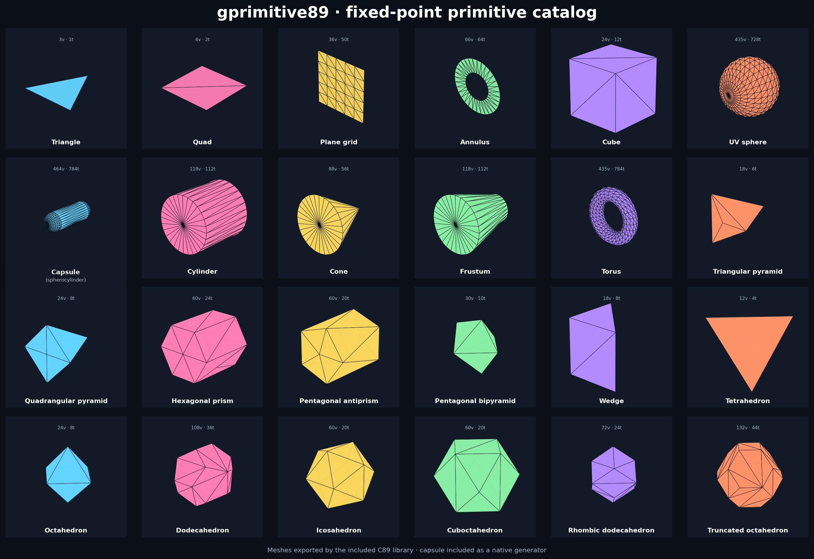

# gprimitive89

`gprimitive89` is a renderer-agnostic C89 mesh generator for built-in 3D geometry.
It writes directly into caller-owned static buffers and emits positions, normals,
tangents, UV coordinates, RGBA vertex colors, triangle indices, and per-triangle
material slots.



The preview above was rendered from OBJ files exported by the included C89 code,
not from a separate hand-modeled asset set.

## Design contract

- ISO C89 source.
- Q16.16 fixed-point geometry and CORDIC trigonometry.
- No dynamic allocation or hidden global mesh pool.
- No renderer, windowing, OpenGL, Direct3D, SDL, or engine dependency.
- Caller owns every vertex and triangle buffer.
- Triangle-list output with 16-bit indices, capped at 65,534 vertices per mesh.
- Deterministic tessellation for the same parameters.
- Optional OBJ exporter is isolated from the dependency-free core.

The core source does not call `malloc`, `realloc`, `free`, or any heap API, and it
does not use floating-point types.

## Included primitive catalog

### Surfaces

- Triangle.
- Quad.
- Segmented plane made from two triangles per grid cell.
- Disc.
- Annulus.

### Rounded and rotational solids

- UV sphere.
- **Capsule / spherocylinder / rounded cylinder** with a cylindrical middle and two hemispherical ends.
- Cylinder with independently selectable caps.
- Cone.
- Truncated cone / frustum.
- Torus.

### Faceted solids and parametric families

- Cube and non-uniform box.
- N-sided prism.
- N-sided pyramid, including triangular and quadrangular pyramids.
- N-sided antiprism.
- N-sided bipyramid.
- Wedge.
- Tetrahedron.
- Octahedron.
- Dodecahedron.
- Icosahedron.
- Cuboctahedron.
- Rhombic dodecahedron.
- Truncated octahedron.
- Arbitrary caller-supplied triangulated polyhedra through
  `gp89_make_custom_flat`.

The generalized prism, pyramid, antiprism, bipyramid, frustum, custom-polyhedron,
and deformation APIs cover many irregular forms without needing a separate
function for every named solid.

## Vertex payload

Each `gp89_vertex` contains:

```text
position.xyz     Q16.16
normal.xyz       Q16.16
tangent.xyzw     Q16.16
uv0.xy           Q16.16
color.rgba       8-bit channels
```

Each `gp89_triangle` contains three 16-bit indices and one 16-bit material slot.
The data can be copied or adapted into an engine-specific interleaved or planar
vertex format.

## Capsule / spherocylinder example

```c
#include "gprimitive89.h"

#define VERTEX_CAPACITY 4096U
#define TRIANGLE_CAPACITY 8192U

static gp89_vertex vertices[VERTEX_CAPACITY];
static gp89_triangle triangles[TRIANGLE_CAPACITY];

int build_capsule(gp89_mesh *mesh)
{
    gp89_mesh_init(mesh,
                   vertices,
                   VERTEX_CAPACITY,
                   triangles,
                   TRIANGLE_CAPACITY);

    return gp89_make_capsule(mesh,
                             GP89_FX_ONE / 2,
                             gp89_fx_from_int(2),
                             32U,
                             8U);
}
```

The second size argument is the straight cylindrical section only. Total height
is therefore `cylinder_height + 2 * radius`. The aliases
`gp89_make_spherocylinder` and `gp89_make_rounded_cylinder` generate the exact
same native topology as `gp89_make_capsule`.

## Color, materials, UVs, and deformation

The generated meshes can be modified without rebuilding them:

```c
gp89_color_axis_gradient(&mesh, GP89_AXIS_Y, bottom_color, top_color);
gp89_material_cycle(&mesh, 4U);
gp89_uv_transform(&mesh, GP89_FX_ONE * 2, GP89_FX_ONE, 0, 0);
gp89_scale(&mesh, GP89_FX_ONE * 2, GP89_FX_ONE, GP89_FX_ONE / 2);
gp89_deform_twist_y(&mesh, GP89_QUARTER_TURN);
gp89_deform_taper_y(&mesh, GP89_FX_ONE, GP89_FX_ONE / 3);
```

Built-in deformation operators:

- Y-axis taper.
- Y-axis twist.
- X/Z shear driven by Y.
- Spherize blend.
- Two-axis sinusoidal Y wave.
- Arbitrary caller callback through `gp89_deform_custom`.

The built-in deformations rebuild normals and tangents afterward. Faceted shapes
use duplicated face vertices, so hard edges remain isolated.

## Build

From MSYS2, MinGW, Linux, or another make environment:

```sh
make
make test
make example
make preview-export
```

The main output is:

```text
build/libgprimitive89.a
```

For a source-vendored engine, compiling `src/gprimitive89.c` directly is also
valid. Add `src/gprimitive89_obj.c` only when the tooling-side OBJ exporter is
wanted.

## Engine integration

`gprimitive89` does not own world transforms or rendering state. A clean engine
integration is:

```text
primitive request
      |
      v
gprimitive89 generator
      |
      +--> caller-owned vertex buffer
      +--> caller-owned triangle buffer
      |
      v
engine mesh adapter
      |
      +--> renderer upload
      +--> collision builder
      +--> serialization/editor preview
```

The local transformation helpers are convenient for standalone use. An engine
that already centralizes transforms in another library can ignore them and use
only the generated local-space mesh arrays.

## Files

```text
gprimitive89/
├── assets/
│   ├── capsule.obj
│   ├── spherocylinder.obj
│   ├── preview.png
│   └── preview_catalog.txt
├── docs/
│   ├── API.md
│   ├── CAPACITY.md
│   ├── INTEGRATION.md
│   └── REFERENCES.md
├── examples/
│   ├── basic_usage.c
│   └── export_preview_meshes.c
├── include/
│   ├── gprimitive89.h
│   └── gprimitive89_obj.h
├── src/
│   ├── gprimitive89.c
│   ├── gprimitive89_obj.c
│   └── gprimitive89_polydata.inc
├── tests/
│   └── test_gprimitive89.c
├── LICENSE
├── Makefile
├── README.md
└── VERSION
```

## Scope boundaries

The custom-polyhedron API accepts already-triangulated faces. It does not attempt
runtime triangulation of arbitrary concave polygons. Subdivision surfaces,
constructive solid geometry, boolean cutting, skeletal skinning, and collision
queries belong in separate systems rather than this primitive generator.
